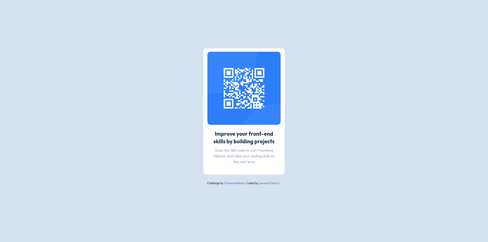

# Frontend Mentor - QR code component solution

This is a solution to the [QR code component challenge on Frontend Mentor](https://www.frontendmentor.io/challenges/qr-code-component-iux_sIO_H).
These challenges help to put into practice what has been learned and improve the skills acquired.

## Table of contents

- [Overview](#overview)
  - [Screenshot](#screenshot)
  - [Links](#links)
- [My process](#my-process)
  - [Built with](#built-with)
  - [What I learned](#what-i-learned)
  - [Continued development](#continued-development)
  - [Useful resources](#useful-resources)
- [Author](#author)
- [Acknowledgments](#acknowledgments)


## Overview

### Screenshot



<p align="center">
  
</p>


## My process

### Built with

- Semantic HTML5 markup
- CSS custom properties
- Flexbox
- Tailwind

### What I learned

The development of this challenge gave me the opportunity to explore a new tool that would help me speed up my work, such as the Tailwind framework.

My biggest challenge was learning how to install and use Tailwind, the installation of Tailwind is quite different if I compare it with another of the most used CSS frameworks such as Bootstrap.

I used the terminal quite a bit, below I share some of the commands and configurations that I used.

1. Tailwind installation:

```
npm install -D tailwindcss
npx tailwindcss init
``` 
2. Configuring template paths and custom properties.   
    For this point add colors, fonts and font sizes in file tailwind.config.js

```js
/** @type {import('tailwindcss').Config} */
module.exports = {
  /**-- adding file paths and templates --*/
  content: ["./src/**/*.{html,js}"],
  theme: {
    extend: {
      /**-- adding base colors --*/
      colors:{
        'white':        'hsl(0, 0%, 100%)',
        'light-gray':   'hsl(212, 45%, 89%)',
        'grayish-blue': 'hsl(220, 15%, 55%)',
        'dark-blue':    'hsl(218, 44%, 22%)',
      },
      /**-- adding base fonts --*/
      fontFamily:{
        'Outfit' :['Outfit'],
      },
      /**-- adding base font sizes --*/
      fontSize:{
        'sm-15': '15px',
      },
    },
  },
  plugins: [],
}
```
3. Add the Tailwind directives to your CSS.  
For this step add a new guideline to be able to import a font from google fonts in the file input.css.

```css
@import url('https://fonts.googleapis.com/css2family=Outfit:wght@100..900&display=swap');
@tailwind base;
@tailwind components;
@tailwind utilities;
```

3. Start the Tailwind CLI build process  

```
npx tailwindcss -i ./src/input.css -o ./src/output.css --watch
```
4. Start using Tailwind in your HTML
```html
<!DOCTYPE html>
<html lang="en">
<head>
  <link href="./output.css" rel="stylesheet">
</head>
```
5. Using tailwind classes in html.  

```html
<figure class="flex justify-center ">

<p class="font-light text-center m-2 px-2 text-sm-15 text-grayish-blue">
  Scan the QR code to visit Frontend Mentor and take your coding skills to the next level
</p>
```
---


### Continued development

This challenge helped me realize how useful and agile it is to develop components with Tailwind CSS and this will be my line of focus. I realized that although this framework uses many native CSS statements, there are some that are specific to the framework and therefore I must learn them, some of the own declarations are, for example, the use of breakpoints, they are abbreviated as follows:
```
sm	640px	@media (min-width: 640px) { ... }
md	768px	@media (min-width: 768px) { ... }
lg	1024px	@media (min-width: 1024px) { ... }
xl	1280px	@media (min-width: 1280px) { ... }
2xl	1536px	@media (min-width: 1536px) { ... }
```
One of the great features that I highlight are the breakpoints, since I had been working on these properties with development techniques such as responsive web, but Tailwind uses mobile first development techniques, making it use min-width instead of max- width, although in the Tailwind documentation by making some extra configurations, it is possible to customize this aspect.


### Useful resources

- [Example resource 1](https://tailwindcss.com/docs/installation) - The official documentation helped a lot to know what configuration I should make to install and use Tailwind

- [Example resource 2](https://css-tricks.com/snippets/css/a-guide-to-flexbox/) - Complete Guide to Flexbox,It is a fairly graphic resource to better understand each property of flex.

- [Example resource 3](https://www.youtube.com/watch?v=5HtRcMSO1Ro&t=4600s) - of course,this guide that helped me a lot to understand the configuration of the Tailwind base files to be able to customize styles, and know how to call the styles through the classes.


## Author

- Frontend Mentor - [@IngLeonardo](https://www.frontendmentor.io/profile/IngLeonardo)
- Github - [IngLeonardo](https://github.com/IngLeonardo)


## Acknowledgments

Thanks to @freecodecampespanol who shares quality content on his YouTube channel, I have seen several of his CSS and HTML courses and now I am taking the Tailwind course, it inspired me to work on this challenge with this framework, I am truly very grateful with the community of developers who share their knowledge and courses.

